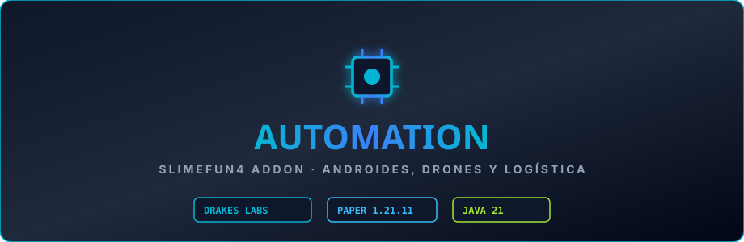

# Automation

Automatización programable para Slimefun, adaptado al ecosistema Slimefun de **DrakesCraft** (Paper/Purpur 1.21.11, Java 21).

## Qué añade

Ordenadores dentro del juego que ejecutan scripts escritos por los jugadores.

## Ojo con esto

> [!WARNING]
> **No está desplegado en DrakesCraft.**
> Se le quitaron todas las salidas a la red que traía: una llamada bloqueante y sin tiempo de espera a un servicio externo para averiguar la IP pública del servidor al arrancar, un WebSocket que abría un puerto aleatorio, un enlace a una página de terceros que se le enseñaba al jugador, y un gestor de paquetes que descargaba scripts de repositorios remotos. Aun así sigue siendo un lenguaje de scripting que ejecutan los jugadores en el servidor, y eso merece una decisión consciente antes de encenderlo.

## Qué cambiamos

Este repositorio **no es un fork**: es el código original integrado en el ecosistema de
DrakesCraft (Paper/Purpur 1.21.11, Java 21). Los cambios comunes a todos nuestros ports son:

**Los paquetes de Slimefun.** El core de DrakesCraft está repaquetado, así que un addon de fuera
no encuentra nada hasta que se remapean sus imports.

**La telemetría, fuera.** bStats abría una conexión a bstats.org cada pocos minutos con datos del
servidor. Se quitaron las llamadas, los imports y la dependencia — no se sustituyó por un stub
inerte, que dejaría el código en pie aparentando que hay telemetría.

**Los autoactualizadores, desarmados.** Este jar está recompilado contra nuestro Slimefun; si se
bajara el de upstream encima, dejaría de cargar. Las actualizaciones se despliegan por SFTP.

**El rastreador de fallos apunta aquí**, no al repositorio original: un fallo de esta versión
casi nunca es un fallo de allí.
